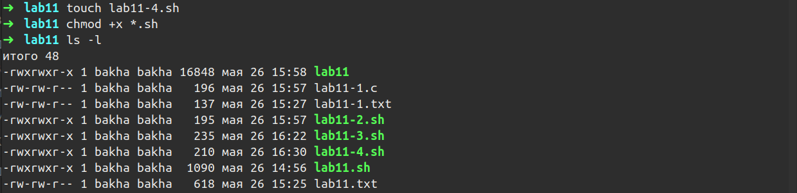

---
## Front matter
title: "Отчёт по лабораторной работе 11"
subtitle: "Программирование в командном процессоре ОС Unix. Ветвление и циклы."
author: "Фомичева Маргарита Романовна"

## Generic otions
lang: ru-RU
toc-title: "Содержание"

## Bibliography
bibliography: bib/cite.bib
csl: pandoc/csl/gost-r-7-0-5-2008-numeric.csl

## Pdf output format
toc: true # Table of contents
toc-depth: 2
lof: true # List of figures
lot: true # List of tables
fontsize: 12pt
linestretch: 1.5
papersize: a4
documentclass: scrreprt
## I18n polyglossia
polyglossia-lang:
  name: russian
  options:
	- spelling=modern
	- babelshorthands=true
polyglossia-otherlangs:
  name: english
## I18n babel
babel-lang: russian
babel-otherlangs: english
## Fonts
mainfont: PT Serif
romanfont: PT Serif
sansfont: PT Sans
monofont: PT Mono
mainfontoptions: Ligatures=TeX
romanfontoptions: Ligatures=TeX
sansfontoptions: Ligatures=TeX,Scale=MatchLowercase
monofontoptions: Scale=MatchLowercase,Scale=0.9
## Biblatex
biblatex: true
biblio-style: "gost-numeric"
biblatexoptions:
  - parentracker=true
  - backend=biber
  - hyperref=auto
  - language=auto
  - autolang=other*
  - citestyle=gost-numeric
## Pandoc-crossref LaTeX customization
figureTitle: "Рис."
tableTitle: "Таблица"
listingTitle: "Листинг"
lofTitle: "Список иллюстраций"
lotTitle: "Список таблиц"
lolTitle: "Листинги"
## Misc options
indent: true
header-includes:
  - \usepackage{indentfirst}
  - \usepackage{float} # keep figures where there are in the text
  - \floatplacement{figure}{H} # keep figures where there are in the text
---

# Цель работы

- Изучить основы программирования в оболочке ОС Unix. Научиться писать более сложные командные файлы с использованием логических управляющих конструкций и циклов.

# Ход работы

### Используя команды getops grep, пишу командный файл, который анализирует командную строку с ключами:

- -iinputfile - прочитать данные из указанного файла

- ooutputfile - вывести данные в указанный файл

- -pшаблон - указать шаблон для поиска

- -C - различать большие и малые буквы

- -n - выдавать номера строк,

### а затем ищет в указанном файле нужные строки, определяемые ключом -р

### Пишу на языке c программу, которая вводит число и определяет, является ли оно больше нуля, меньше нуля или равно нулю. Затем программа завершается с помощью функции exit(n), передавая информацию о коде завершения в оболочку. Командный файл должен вызывать эту программу и, проанализировав с помощью команды &?, выдать сообщение о том, какое число было введено

### Пишу командный файл, создающий указанное число файлов, пронумерованных последовательно от 1 до N. Число файлов, которые необходимо создать, передаётся в аргументы командной строки. Этот же командный файл должен уметь удалять все созданные им файлы (если они существуют).

### Написала командный файл, который с помощью команды tar запаковывает в архив все файлы в указанной директории. Модифицирую командный файл так, чтобы запаковывались только те файлы, которые были изменены менее недели тому назад (использую команду find)

# Вывод 

- Я изучила основы программирования в оболочке ОС Unix более подробно. Научилась писать более сложные командные файлы с использованием логических управляющих конструкций и циклов.

# Ответы на контрольные вопросы

###  Какого предназначение команды getopts?

- Команда getopts - это встроенная команда оболочки bash, которая предназначена для разбора параметров сценария. Команда обрабатывает только однобуквенные параметры и с аргументами, и без них.

### Какое отношение метасимволы имеют к генерации имён файлов?

- При генерации имен используют метасимволы:

- произвольная (возможно пустая) последовательность символов

- ? один произвольный символ

- [...] любой из символов, указанных в скобках перечислением и/или с указанием диапазона

- cat f* выдаёт все файлы каталога, начинающиеся с "f"

- cat f выдаёт все файлы, содержащие "f"

- cat program.? выдаёт файлы данного каталога с однобуквенными расширениями, скажем "program.c" и "program.o", но не выдаст "program.com"

- cat [a-d]* выдаёт файлы, которые начинаются с "a", "b", "c", "d". Такой же результат выдадут и команды "cat [abcd]" и "cat [bdac]".

### Какие операторы управления действиями вы знаете?

- Операторы && и || это управляющие операторы. Если в командной строке стоит command1 && command2, то command2 выполняется в том случае, если статус выхода из команды command1 равен нулю, что говорит о ее успешном завершении. Так же, если командная строка имеет вид command1 || command2, то команда command2 выполняется тогда, когда статус выхода из команды command1 отличен от нуля.

### Какие операторы используются для прерывания цикла?

- Оператор break. Он завершает выполнение ближайшего включающего цикла или условного оператора, в котором он отображается.

### Для чего нужны команды false и true?

- Команда true всегда возвращает ноль в качестве выходного статуса для индикации успеха. 

- Команда false всегда возвращает не-ноль в качестве выходного статуса для индикации неудачи. 

- Во всех управляющих конструкциях в качестве логического значения используется код возврата из программы, указанной в качестве условия. Код возврата 0 – истина, любое другое значение – ложь. Программа true – всегда завершается с кодом 0, false – всегда завершается с кодом 1.

### Что означает строка if test -f man$s/$i, встреченная в командной файле?

- Данная строка строка означает условие существования файла man$s/$i.$s

### Объясните различия между конструкциями while и until?

- Цикл While выполняется до тех пор, пока указанное в нем условие истинно. Когда указанное условие становится ложным - цикл завершается. 
- Цикл Until выполняется до тех пор, пока указанное в нем условие ложно.