---
## Front matter
title: "Отчёт по лабораторной работе 3"
subtitle: "Простейший вариант"
author: "Фомичева Маргарита Романовна"

## Generic otions
lang: ru-RU
toc-title: "Содержание"

## Bibliography
bibliography: bib/cite.bib
csl: pandoc/csl/gost-r-7-0-5-2008-numeric.csl

## Pdf output format
toc: true # Table of contents
toc-depth: 2
lof: true # List of figures
lot: true # List of tables
fontsize: 12pt
linestretch: 1.5
papersize: a4
documentclass: scrreprt
## I18n polyglossia
polyglossia-lang:
  name: russian
  options:
	- spelling=modern
	- babelshorthands=true
polyglossia-otherlangs:
  name: english
## I18n babel
babel-lang: russian
babel-otherlangs: english
## Fonts
mainfont: PT Serif
romanfont: PT Serif
sansfont: PT Sans
monofont: PT Mono
mainfontoptions: Ligatures=TeX
romanfontoptions: Ligatures=TeX
sansfontoptions: Ligatures=TeX,Scale=MatchLowercase
monofontoptions: Scale=MatchLowercase,Scale=0.9
## Biblatex
biblatex: true
biblio-style: "gost-numeric"
biblatexoptions:
  - parentracker=true
  - backend=biber
  - hyperref=auto
  - language=auto
  - autolang=other*
  - citestyle=gost-numeric
## Pandoc-crossref LaTeX customization
figureTitle: "Рис."
tableTitle: "Таблица"
listingTitle: "Листинг"
lofTitle: "Список иллюстраций"
lotTitle: "Список таблиц"
lolTitle: "Листинги"
## Misc options
indent: true
header-includes:
  - \usepackage{indentfirst}
  - \usepackage{float} # keep figures where there are in the text
  - \floatplacement{figure}{H} # keep figures where there are in the text
---

# Цель работы

- Научиться оформлять отчёты с помощью легковесного языка Markdown (отчёт по лабораторатной работе 2 в MD)

# Установка програмного обеспечения 
## Установка git-flow в Fedora Linux

- Устанавливаю програмное обеспечение

## Установка gh в Fedora Linux

- Устанавливаю gh в Fedora Linux с помощью команды sudo dnf install gh

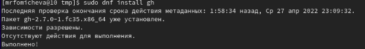

## Базовая настройка Git

- Провожу базовую настройку git

1. Задаю имя и email владельца репозитория

2. Настраиваю utf-8 в выводе сообщений git

3. Настраиваю верификацию и подписываю коммиты git (задаю имя начальной ветки)

4. Параметр autocrlf

5. Параметр safecrlf

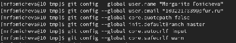

## Создание ключа ssh

1. по алгоритму rsa с ключём размером 4096 бит

2. по алгоритму ed25519

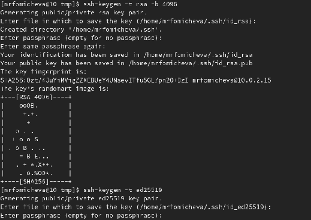

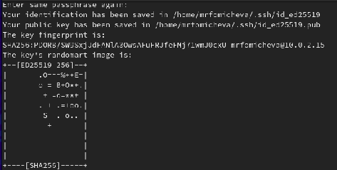

## Создание ключа pgp

1. Генерирую ключ

2. Из предложенных опций выбираю необходимые по заданию

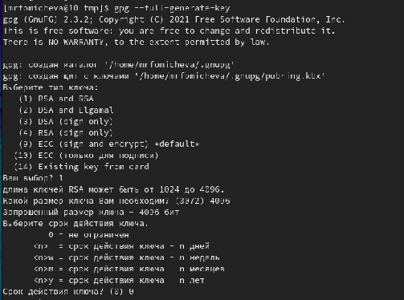

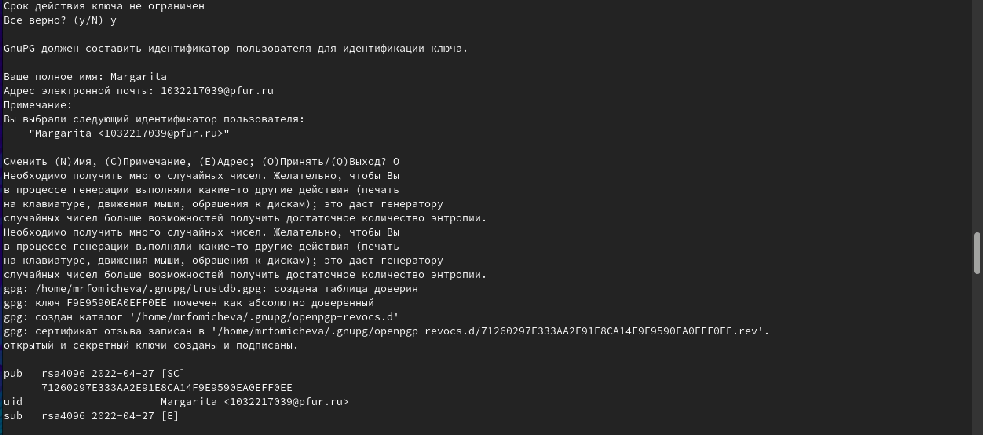

## Добавление PGP ключа в GitHub

1. Вывожу список ключей и копируем отпечаток приватного ключа

2. Копирую сгенерированный pgp ключ в буфер обмена, перехожу в настройки  GitHub и вставляю полученный ключ в поле ввода

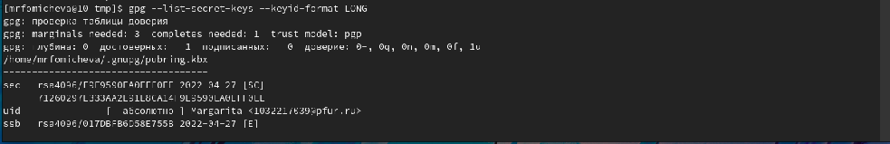

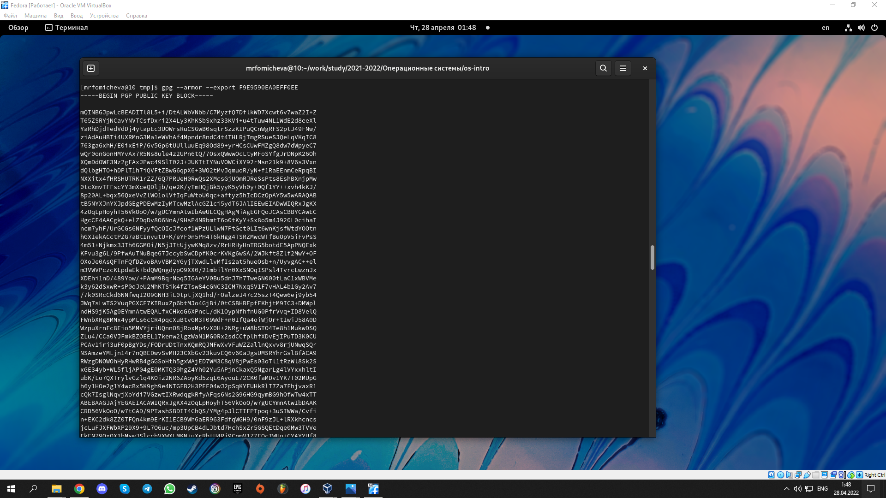

## Скриншот с добавленными ключами SSH и GPG в GitHub
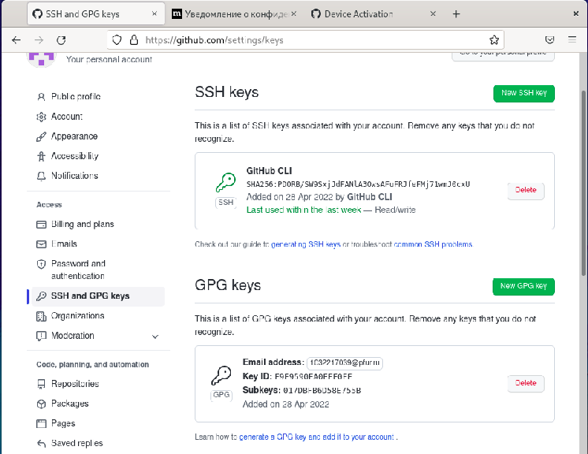

## Настройка автоматических подписей коммитов git

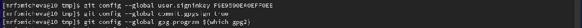

## Настройка gh

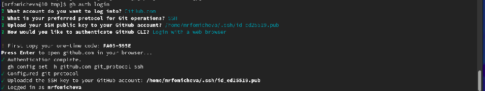

## Создание репозитория курса на основе шаблона
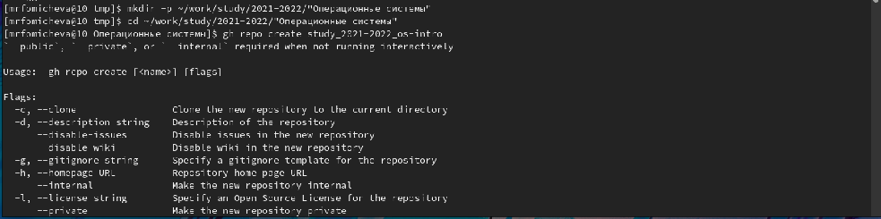

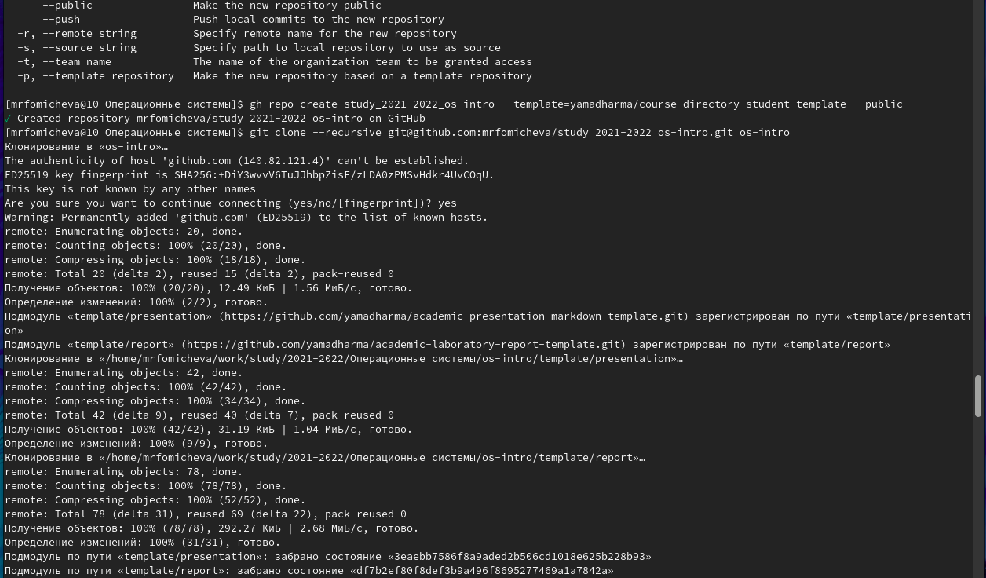

## Настройка каталога курса 

1. Перехожу в каталог курса

2. Удаляю лишние файлы

3. Создаю необходимые каталоги

4. Отправляю файлы на сервер

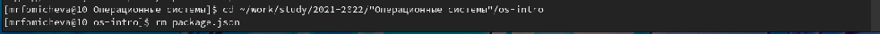

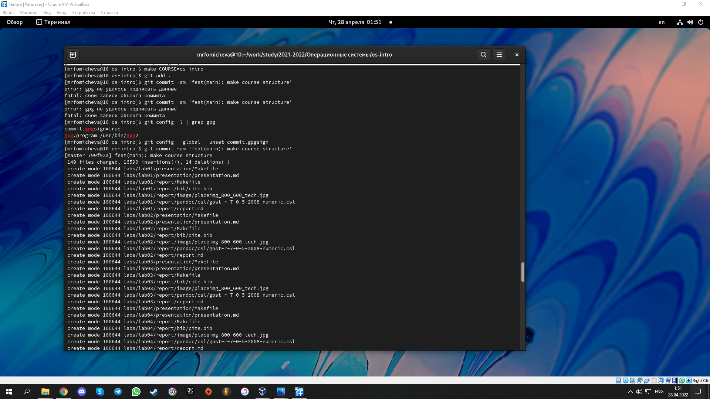

# Ответы на контольные вопросы (из лабораторной работы 2)
